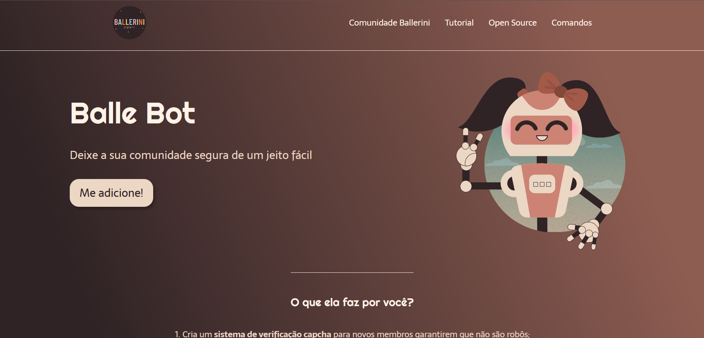
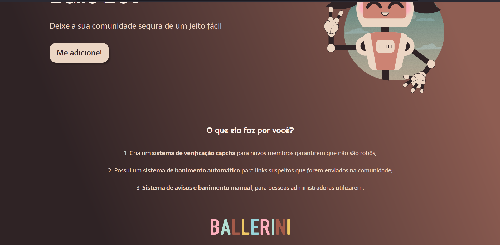

#  Projeto: BalleBot
Uma landing page que faria a propaganda de um bot para adicionar ao Discord.
## Imagem da página:
 
## Sobre o projeto:
Essa é uma landing page que desenvolvi seguindo os passos de Rafaella Ballerini, com o objetivo de testar os meus conhecimentos em HTML e CSS.

### Tecnologias utilizadas:
* HTML;
* CSS;
* Figma.
